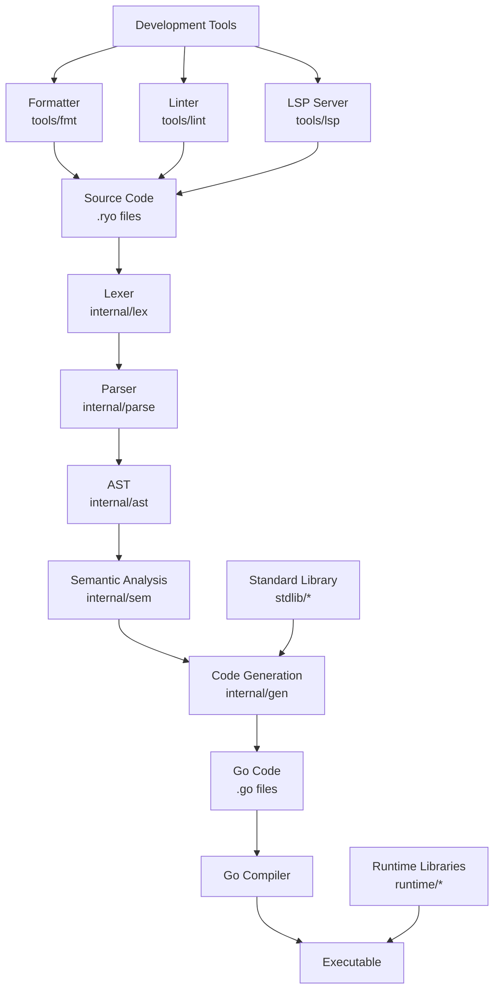

# Rayo Language Architecture

This document describes the high-level architecture of the Rayo programming language implementation.

## Overview

Rayo is a programming language that transpiles to Go. The architecture follows a traditional compiler pipeline with distinct phases for lexical analysis, parsing, semantic analysis, and code generation.



## Architecture Components

### Core Compiler Pipeline

1. **Lexer (internal/lex)**
   - Tokenizes source code into lexical tokens
   - Handles keywords, identifiers, operators, literals
   - Manages whitespace and comments

2. **Parser (internal/parse)**
   - Converts token stream into Abstract Syntax Tree (AST)
   - Implements the language grammar
   - Performs syntax error checking

3. **AST (internal/ast)**
   - Defines the abstract syntax tree data structures
   - Represents the parsed source code structure
   - Used by semantic analysis and code generation

4. **Semantic Analysis (internal/sem)**
   - Performs type checking and inference
   - Builds symbol tables
   - Detects semantic errors
   - Enables optimizations

5. **Code Generation (internal/gen)**
   - Translates AST to Go source code
   - Handles control flow lowering
   - Manages variable scoping
   - Optimizes generated code

### Runtime System

6. **Runtime Libraries (runtime/)**
   - **core**: Core runtime functionality
   - **dict**: Dictionary/map implementation
   - **err**: Error handling system
   - **obj**: Object system and reflection

7. **Standard Library (stdlib/)**
   - **core**: Basic functions (math, strings, time, etc.)
   - **data**: Data processing utilities
   - **http**: HTTP server framework
   - **io**: Input/output operations

### Development Tools

8. **Formatter (tools/fmt)**
   - Formats source code according to style guidelines
   - Ensures consistent code formatting

9. **Linter (tools/lint)**
   - Performs static analysis
   - Detects potential bugs and style issues
   - Provides suggestions for improvement

10. **LSP Server (tools/lsp)**
    - Implements Language Server Protocol
    - Provides IDE integration features
    - Supports syntax highlighting, completion, diagnostics

## Data Flow

```text
Source (.ryo)
    ↓
Lexer → Tokens
    ↓
Parser → AST
    ↓
Semantic Analysis → Annotated AST
    ↓
Code Generation → Go Code
    ↓
Go Compiler → Executable
```

## Key Design Decisions

- **Transpilation Approach**: Rayo compiles to Go rather than having its own runtime, leveraging Go's performance and ecosystem
- **Modular Architecture**: Clear separation of concerns with dedicated packages for each compilation phase
- **Tool Ecosystem**: Comprehensive development tools including formatter, linter, and LSP server
- **Standard Library**: Rich standard library covering common programming needs
- **Extensibility**: Plugin architecture for tools and runtime extensions

## File Organization

```text
rayo/
├── cmd/rayo/           # Main CLI tool
├── internal/           # Internal compiler packages
│   ├── ast/           # Abstract Syntax Tree
│   ├── diag/          # Diagnostics
│   ├── gen/           # Code generation
│   ├── lex/           # Lexer
│   ├── parse/         # Parser
│   ├── sem/           # Semantic analysis
│   └── testutil/      # Testing utilities
├── runtime/           # Runtime libraries
│   ├── core/
│   ├── dict/
│   ├── err/
│   └── obj/
├── stdlib/            # Standard library
│   ├── core/
│   ├── data/
│   ├── http/
│   └── io/
├── tools/             # Development tools
│   ├── fmt/
│   ├── lint/
│   └── lsp/
└── examples/          # Example programs
```