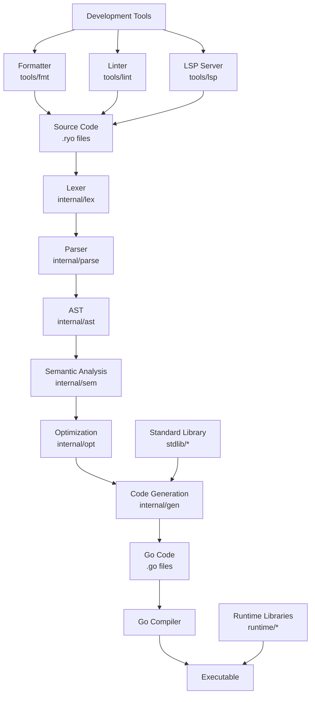

# Rayo Language Architecture

This document describes the high-level architecture of the Rayo programming language implementation.

## Overview

Rayo is a programming language that transpiles to Go. The architecture follows a traditional compiler pipeline with distinct phases for lexical analysis, parsing, semantic analysis, and code generation.


```mermaid
graph TD
    A[Source Code<br/>.ryo files] --> B[Lexer<br/>internal/lex]
    B --> C[Parser<br/>internal/parse]
    C --> D[AST<br/>internal/ast]
    D --> E[Semantic Analysis<br/>internal/sem]
    E --> P[Optimization<br/>internal/opt]
    P --> F[Code Generation<br/>internal/gen]
    F --> G[Go Code<br/>.go files]

    G --> H[Go Compiler]
    H --> I[Executable]

    J[Runtime Libraries<br/>runtime/*] --> I
    K[Standard Library<br/>stdlib/*] --> F

    L[Development Tools] --> M[Formatter<br/>tools/fmt]
    L --> N[Linter<br/>tools/lint]
    L --> O[LSP Server<br/>tools/lsp]

    M --> A
    N --> A
    O --> A
```

## Architecture Components

### Core Compiler Pipeline

1. **Lexer (internal/lex)**
   - Tokenizes source code into lexical tokens
   - Handles keywords, identifiers, operators, literals
   - Manages whitespace and comments

2. **Parser (internal/parse)**
   - Converts token stream into Abstract Syntax Tree (AST)
   - Implements the language grammar
   - Performs syntax error checking

3. **AST (internal/ast)**
   - Defines the abstract syntax tree data structures
   - Represents the parsed source code structure
   - Used by semantic analysis and code generation

4. **Semantic Analysis (internal/sem)**
   - Performs type checking and inference
   - Builds symbol tables
   - Detects semantic errors
   - Enables optimizations

5. **Optimization (internal/opt)**
   - AST-to-AST passes between semantics and codegen
   - Constant folding of literal expressions (behavior-preserving)

6. **Code Generation (internal/gen)**
   - Translates AST to Go source code
   - Handles control flow lowering
   - Manages variable scoping
   - Optimizes generated code

### Runtime System

7. **Runtime Libraries (runtime/)**
   - **core**: Core runtime functionality
   - **dict**: Dictionary/map implementation
   - **err**: Error handling system
   - **obj**: Object system and reflection

8. **Standard Library (stdlib/)**
   - **core**: Basic functions (math, strings, time, etc.)
   - **data**: Data processing utilities
   - **http**: HTTP server framework
   - **io**: Input/output operations

### Development Tools

9. **Formatter (tools/fmt)**
   - Formats source code according to style guidelines
   - Ensures consistent code formatting

10. **Linter (tools/lint)**
   - Performs static analysis
   - Detects potential bugs and style issues
   - Provides suggestions for improvement

11. **LSP Server (tools/lsp)**
    - Implements the Language Server Protocol over both TCP and stdio transports (`serve()` drives one shared read/dispatch loop for both)
    - Lifecycle: `initialize` (with client capability negotiation) → `initialized` → requests → `shutdown` → `exit`, guarded so requests before `initialize` return a structured "server not initialized" error
    - Diagnostics, hover, and go-to-definition
    - Completion: lexer keywords (via `lex.Keywords()`), in-scope declared names, and `def`/`if`/`try` snippets (snippet vs plain-text chosen from negotiated `snippetSupport`)
    - Navigation: find references, hierarchical document symbols, and workspace symbols (scoped to open documents)
    - Structured JSON-RPC error handling with standard error codes

## Data Flow

```text
Source (.ryo)
    ↓
Lexer → Tokens
    ↓
Parser → AST
    ↓
Semantic Analysis → Annotated AST
    ↓
Optimization (constant folding) → Optimized AST
    ↓
Code Generation → Go Code
    ↓
Go Compiler → Executable
```

## Diagnostics and Source Spans

All compiler phases share one position model defined in `internal/diag`:

- `diag.SourcePos` — byte `Offset`, 1-based `Line`, 1-based `Col`.
- `diag.Span` — a `Start`/`End` pair. `Span.IsZero()` reports an unset span.
- `diag.Severity` — `SeverityError`, `SeverityWarning`, or `SeverityInfo`.
- `diag.Reporter` — the minimal sink (`Report(span, msg)`); reporters that care
  about severity implement `diag.SeverityReporter` and receive `ReportAt(span, sev, msg)`.
  Callers use the free function `diag.ReportAt(rep, span, sev, msg)`, which
  preserves severity when the reporter supports it and falls back to `Report`
  otherwise.

How positions flow through the pipeline:

1. The **lexer** records the *start* line/col and byte offset of every token.
   Multi-character tokens (identifiers, numbers, strings, operators) report the
   column where the token begins.
2. `parse.TokenSpan` turns a token into a `diag.Span`, deriving the end position
   from the token value (correctly handling multi-line string literals).
   `parse.MergeSpans` combines two spans into the smallest covering span.
3. The **parser** attaches spans to AST nodes via `ast.SetSpan` (every node
   implements `ast.SpanSetter`), so leaf nodes carry their token span and
   compound nodes span from their first to last child.
4. **Semantic analysis** reports through `diag.ReportAt` using the offending
   node's `Span()`, so unused-variable warnings and null-safety errors point at
   real source ranges with the right severity.
5. The **LSP server** maps `diag.Span` to LSP ranges (1-based → 0-based) and
   maps `diag.Severity` to LSP severities (Error/Warning/Information) directly,
   without guessing from message text.

## Testing: Golden Harness and Fuzzing

The golden harness (`golden/`, driven by `rayo test` and `go test ./golden`)
loads fixtures from `testdata/golden/`. Each `<name>.ryo` may have sidecars:

- `<name>.tokens` — expected token dump (`Kind "value"` per line).
- `<name>.ast` — expected pretty-printed AST.
- `<name>.go` — expected generated Go source.
- `<name>.out` — expected stdout after transpile + `go run`.
- `<name>.diags` — expected diagnostics for a "bad" program. When present, the
  harness tolerates parse errors and compares a stable dump of parser +
  semantic diagnostics formatted as `line:col: severity: message`, sorted by
  position. This is how negative cases (e.g. `expected function name`) and
  advisory warnings (e.g. `unused variable`) are snapshotted.

A `.ryo` with no sidecars is smoke-compiled only.

The lexer and parser fuzz targets (`FuzzLexerRoundTrip`, `FuzzParserRoundTrip`)
seed their corpora from the inline seeds *and* every `testdata/golden/*.ryo`
source, and assert invariants (valid token positions, consistent node spans) in
addition to crash-freedom. Run them with, for example,
`go test ./internal/parse -run x -fuzz FuzzParserRoundTrip -fuzztime 15s`.

## Key Design Decisions

- **Transpilation Approach**: Rayo compiles to Go rather than having its own runtime, leveraging Go's performance and ecosystem
- **Modular Architecture**: Clear separation of concerns with dedicated packages for each compilation phase
- **Tool Ecosystem**: Comprehensive development tools including formatter, linter, and LSP server
- **Standard Library**: Rich standard library covering common programming needs
- **Extensibility**: Plugin architecture for tools and runtime extensions

## File Organization

```text
rayo/
├── cmd/rayo/           # Main CLI tool
├── golden/             # Golden test harness (shared with `rayo test`)
├── internal/           # Internal compiler packages
│   ├── ast/           # Abstract Syntax Tree
│   ├── diag/          # Diagnostics
│   ├── gen/           # Code generation
│   ├── lex/           # Lexer
│   ├── opt/           # Optimization passes (constant folding)
│   ├── parse/         # Parser
│   ├── sem/           # Semantic analysis
│   └── compile/       # Multi-file compile, import graph, main() lowering
├── runtime/           # Runtime libraries
│   ├── core/
│   ├── dict/
│   ├── err/
│   └── obj/
├── stdlib/            # Standard library
│   ├── core/
│   ├── data/
│   ├── http/
│   └── io/
├── tools/             # Development tools
│   ├── fmt/
│   ├── lint/
│   └── lsp/
└── examples/          # Example programs
```